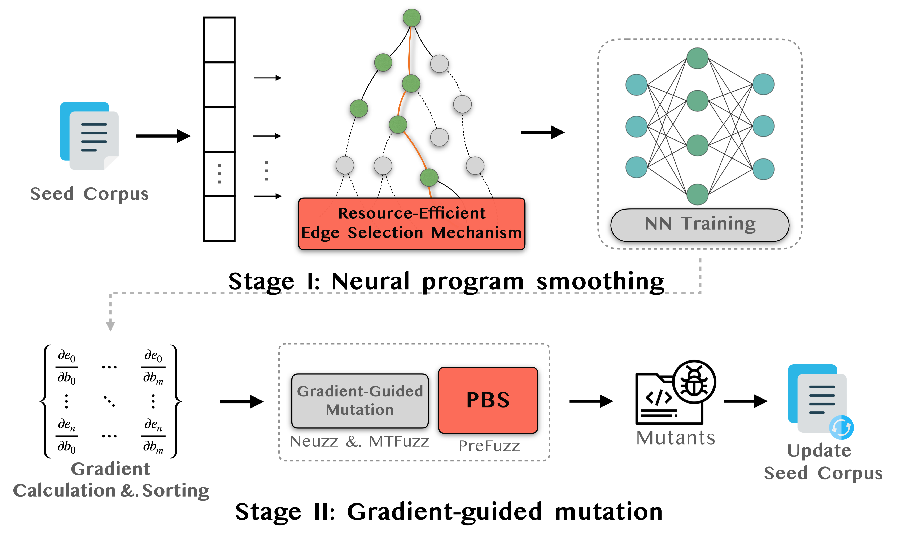

# PreFuzz
PreFuzz is a neural program-smoothing-based fuzzing to guide fuzzing mutation with resource-efficient edge selection and probabilistic byte selection. PreFuzz is implemented based on [Neuzz](https://github.com/Dongdongshe/neuzz).

 


## Published Work

[Evaluating and Improving Neural Program-Smoothing-based Fuzzing](https://dl.acm.org/doi/pdf/10.1145/3510003.3510089), ICSE 2022.

```
@article{wu2022evaluating,
  title={Evaluating and Improving Neural Program-Smoothing-based Fuzzing},
  author={Wu, Mingyuan and Jiang, Ling and Xiang, Jiahong and Zhang, Yuqun and Yang, Guowei and Ma, Huixin and Nie, Sen and Wu, Shi and Cui, Heming and Zhang, Lingming},
  year={2022}
}
```

## Setup

### Environment

Tested on Linux verison 4.15.0-76-generic Ubuntu 18.04 64bit with RTX 2080ti

- Python (>= 3.7)
- Pytorch 1.3.1

### Fuzzing with PreFuzz
> Limited by the implementation, the execution should be in the same directory

```shell
# train model and communicate with fuzzer via socket
$ python nn.py /path/to/program [params]

# start fuzz (max_len: maximum size of the inital seed corpus)
$ ./fuzz -i fuzz_input -o seeds -l max_len /path/to/program [params] @@
```

## Contact
Feel free to send an email at tricker51449@gmail.com.